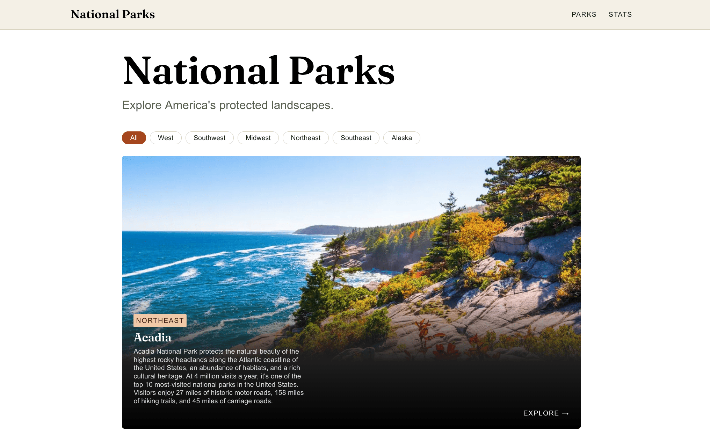

# National Parks


   

An editorial-style guide to 20 U.S. national parks, built with Next.js and Sanity. It has image-led listing and detail pages, and one interactive piece: a bar chart that makes a simple point, **big isn't the same as busy**. Some of the largest parks get a tiny share of the visitors that much smaller parks do.

   **Live site:** [nationalparkswiki.netlify.app](https://nationalparkswiki.netlify.app/)
**Data:** park acreage and recreation visits from the National Park Service, [2025]

## What's in it

- **Listing page** with large image cards (the first one is a feature card), a region filter, a staggered entrance animation, and a short teaser that leads to the stats page.
- **Detail pages** for every park, with a full-bleed hero image, key stats, and highlights. Each page has its own title, description, and social-share image.
- **Stats page** (`/stats`) with the interactive chart: a toggle between annual visitors and acres. Bars re-sort and slide to their new positions when the metric changes, and hovering or focusing a bar shows a tooltip with the park name and value.
- **Embedded CMS** at `/studio`, so every park can be edited without touching code.
- **Light and dark themes** that follow the OS setting, plus support for reduced motion.

## Tech stack

| Layer | Choice |
| --- | --- |
| Framework | Next.js (App Router), React, TypeScript |
| Content | Sanity (headless CMS), queried with GROQ |
| Styling | Hand-written CSS with CSS Modules and design tokens, no CSS framework |
| Chart | Hand-rolled SVG in one client component, no chart library |
| Fonts | Fraunces (headings) via `next/font`, system sans for body text |
| Hosting | Netlify, deployed from GitHub |

## Running it locally

You need Node 20 or newer and a Sanity project.

```bash
npm install
npm run dev
```

- Site: `http://localhost:3000`
- Studio: `http://localhost:3000/studio`

Create a `.env.local` file in the project root. The Sanity project ID and dataset values were generated by `sanity init`, so copy whatever names it wrote there. Add the site URL too:

```bash
NEXT_PUBLIC_SANITY_PROJECT_ID=...
NEXT_PUBLIC_SANITY_DATASET=production
NEXT_PUBLIC_SITE_URL=http://localhost:3000   # set to the real domain when deployed
```

To check that everything compiles and see which routes are static, run `npm run build`.

## Project structure

```
src/
  app/
    layout.tsx             Fonts, site header, site-wide metadata
    page.tsx               Listing, stats teaser, and region filter
    stats/page.tsx         The chart page
    parks/[slug]/page.tsx  Detail page, static params, per-page metadata
    not-found.tsx          Custom 404
    studio/                Embedded Sanity Studio
  components/
    SiteHeader.tsx         Sticky nav (server component)
    ParkCard.tsx           Image card with a single stretched link
    RegionFilter.tsx       Filter pills driven by URL query params
    StatsTeaser.tsx        Homepage band linking to /stats
    ParksChart.tsx         The chart (the only client component)
  sanity/                  Studio config, schema, and client
  regions.ts               One list of regions, shared by filter and validation
  types.ts                 Shared TypeScript types
```

## How I thought about it

This section covers the decisions I made and why. Where something was a tradeoff, I've said so.

### 1. A headless CMS, so content and presentation are separate

Park data lives in Sanity, and Next.js is the website that reads it. Editors change content in Studio and developers control how it looks. The schema is the contract between the two. If I rename a field, the queries and components that use it have to change too.

I embedded Studio at `/studio` instead of running a separate admin app. That means one codebase and one deployment, with no second URL to manage.

I added `required()` validation on `name` and `slug` so an editor can't publish a park that would produce a broken page or URL.

### 2. Server components by default, one client component on purpose

Pages fetch data on the server, so there's no loading spinner, no `useEffect`, and the content is in the HTML for search engines. The only code that ships to the browser as JavaScript is `ParksChart`, because it needs state (the active metric and the hovered bar) and event handlers. Because the chart has its own route, that JavaScript only loads on `/stats`, and the homepage and detail pages stay light. Everything else, including the header, cards, filter, and teaser, stays on the server and sends no JavaScript.

### 3. Rendering and caching

- **Detail pages** are pre-rendered at build time with `generateStaticParams`. A park published later is rendered on demand and then cached.
- **The stats page** has no `searchParams`, so unlike the homepage it can be pre-rendered as static content, and `revalidate: 60` keeps it fresh.
- **Fetches** use `revalidate: 60`, so edits in Studio appear within about a minute without a redeploy.
- **Shared fetch:** the detail page uses React's `cache()` so `generateMetadata` and the page itself share one request.
- **Tradeoff:** the homepage reads `searchParams` for the region filter, so it renders per request and is no longer fully static. Sanity's fetch caching keeps it fast. I chose this because a filter in the URL is shareable, bookmarkable, works without JavaScript, and keeps the page a server component. The alternative was client-side state, which would have added JavaScript for little benefit.
- **Input validation:** the `region` param is checked against the known list, so a junk query string falls back to "All" instead of showing an empty page.

### 4. The chart: its own page, hand-rolled SVG, linear scale

- **Why it has its own page:** it started at the bottom of the homepage and I moved it. See section 10 for the reasoning.
- **Why SVG by hand:** the chart is 20 bars. A charting library would add a large bundle to draw rectangles, and the scale math is about five lines.
- **Why a linear scale, not a log scale:** a log scale would make small parks easier to read, but it would also hide the whole point. On a linear scale the huge Alaska parks dwarf everything on the acres view and nearly disappear on the visitors view, and that's the honest picture.
- **Why the animation works:** each row is positioned with a CSS `transform`, and bar widths are CSS-transitioned. When the metric changes, React just updates the ranking, and the browser animates the rows to their new positions. There's no animation library.
- **Why the bars grow on scroll:** an `IntersectionObserver` waits until the chart is on screen, then triggers a staggered growth. Later toggles skip the stagger so the re-sort feels snappy.
- **Tradeoff:** the bars start at zero width in the server HTML, so the chart is empty until JavaScript runs. For a portfolio piece I accepted that for the entrance effect. For production I would render the final widths on the server and animate only for users who haven't asked for reduced motion.

### 5. Design: editorial, not template

I wanted it to look like a magazine feature instead of a tutorial app.

- **Palette:** a forest-and-canyon scheme (warm paper background, deep green, rust accent) with a full dark-mode variant.
- **Type:** Fraunces for display headings, with fluid `clamp()` sizes that scale from phone to desktop without breakpoints.
- **Layout:** large image cards with text over a gradient, and a full-bleed hero on each detail page.
- **Tokens:** colors, spacing, radius, type scale, and easing live as CSS variables in one file, so restyling means editing one place.
- **No framework:** I chose plain CSS Modules so the styling itself is visible and reviewable.

### 6. Accessibility

- Semantic HTML throughout: `nav`, `main`, `article`, `dl` for stats, and a real `h1` per page.
- Each card has one real link, stretched over the whole card with `::after`, so the card is a big click target but a screen reader hears one link. The focus ring is moved to the card with `:has()`, since the default ring would only outline the title text.
- The chart's toggle is a radio group, each bar is keyboard-focusable and announces its value, the tooltip shows on focus as well as hover, and the caption is an `aria-live` region so a re-sort is announced.
- The teaser is a labelled `section` with a real heading, and its decorative arrow is hidden from screen readers.
- Images have editable alt text in the schema.
- Visible focus states everywhere, and a `prefers-reduced-motion` rule that disables transitions and animations, including on pseudo-elements.
- Text colors have light and dark variants, so contrast holds in both themes. I checked with Lighthouse.

### 7. Motion with CSS first

All animation sticks to `opacity` and `transform`, which the browser can animate without recalculating layout.

- Cards and detail-page hero text rise in with staggered delays, and the stagger is capped so card 20 doesn't wait seconds to appear.
- The detail-page stat tiles and the header shadow use **scroll-driven animations** (`animation-timeline`). They replace the usual scroll-listener pattern and run off the main thread.
- Those scroll-driven rules are wrapped in `@supports`, so browsers without support skip the animation and show the content normally. That's progressive enhancement, and nothing breaks without it.
- The stats page heading uses a plain load animation instead. A scroll-driven reveal made sense at the bottom of a long page, but at the top it would fire immediately.

### 8. Data quality

The chart is only as good as its numbers. Every park needs `acres` and `annualVisitors` to appear in it, and the query drops any park missing either field, so incomplete entries don't produce misleading bars. All figures come from the NPS for a single year, because mixing years would undermine a chart that makes a comparison.

### 9. Deployment

The site is deployed on Netlify from GitHub, which rebuilds on every push. Netlify supports the App Router and both on-demand and time-based revalidation, so no framework-specific configuration was needed. Two things were worth knowing:

- **Secrets scanning:** Netlify's build scanner flagged the Sanity project ID because `NEXT_PUBLIC_` values are embedded in the client bundle. The project ID is public by design (it appears in every API request), so I excluded just the two public Sanity variables with `SECRETS_SCAN_OMIT_KEYS`. I did not disable scanning, because it should still protect real secrets, such as an API token if I add one later. Those would never get a `NEXT_PUBLIC_` prefix.
- **CORS:** the embedded Studio runs in the browser, so the live domain has to be added to the project's CORS origins in Sanity, with credentials allowed.

### 10. Iterating: a product decision and the bugs along the way

#### Moving the chart to its own page, and adding a teaser

**The problem.** My first version put the chart at the bottom of the homepage, below 20 image cards, with a "Stats" link in the nav that jumped down to it. Once I could see the whole page, it felt off. It read like two products stacked together: a browsing experience (pick a park) followed by an analytical one (compare parks). I trusted that instinct and then checked it against UX principles, instead of defending the first layout.

**My reasoning.**

- **Different tasks need different mindsets.** Browsing is quick and visual, and comparing is slower and analytical. Making one page do both weakened each of them.
- **Discoverability was weak.** Few visitors scroll past 20 cards, so the piece I'm proudest of was the one least likely to be seen.
- **A page of its own can tell the story properly.** It gets a real headline, a written takeaway, and a source note, and it can be linked to directly. I can send someone to `/stats` instead of saying "scroll to the bottom."
- **It's lighter.** The chart is the only client-side JavaScript in the project, and a separate route means the homepage and detail pages don't load it.

**The tradeoff I weighed.** Moving it created a new risk: visitors who never click the nav might never see the chart, and a separate page can make a feature feel optional. The chart is the most interactive part of the project, so hiding it would have been a bad trade.

**The fix: a teaser band.** I added a short band under the page headline, above the filter. It states the finding in a sentence and links to the chart page. The thinking behind it:

- **Placement.** It sits near the top, where it's visible without scrolling, but it's one band tall, so the cards still start high on the page. The listing is still the main event.
- **It sells the idea, not the feature.** The copy leads with the finding ("big isn't the same as busy"), because a claim is a better reason to click than a label like "Stats."
- **One clear action.** There's a single button and nothing else competing with it.
- **It stands apart from the cards.** A solid forest-colored band is visually different from the image cards, so it reads as a signpost and not as another park. It's a small contrast in a layout where everything else is photography.
- **It's cheap.** It's a server component with no JavaScript and no extra data fetching.

**What I haven't tested.** This decision comes from UX principles and my own judgment, not from user testing or analytics. If I had traffic, I would compare how many visitors reach the chart with the teaser versus the original bottom-of-page layout, and I'd try a version with a mini bar preview inside the band, since showing the contrast could persuade more than describing it.

**What it taught me.** Layout is a decision about priorities, not just a place to put things. Moving something away from where people are looking means giving them a reason and a path to follow it.


### 11. Bugs that taught me something

- **A one-column grid that looked fine in DevTools.** Leftover template CSS had made `body` a column flex container, so `<main>` shrank to fit its content and the `auto-fill` grid had no room for more than one column. The fix was removing the flex layout from `body`. The lesson is to check the parents of a broken layout, not just the element itself.
- **Template variables that didn't exist.** The same file referenced `--foreground` and `--background`, which my tokens never defined, so the page quietly fell back to browser defaults. I replaced them with my own tokens.
- **A sticky header that depends on overflow.** `position: sticky` stops working if an ancestor clips overflow, so I used `overflow-x: clip` on `body` instead of `hidden`.

## Known limitations and next steps

- **Instant updates:** the site picks up edits through time-based revalidation (about a minute). A Sanity webhook that triggers on-demand revalidation would make edits go live immediately.
- **Chart on the server:** render real bar widths in the initial HTML (see tradeoff above).
- **Long chart on mobile:** 20 rows is tall on a phone. Options are a "show top 10" toggle or a horizontal layout.
- **Teaser preview:** the homepage teaser is text and a button. A few static bars previewing the contrast would be more persuasive than words.
- **Chart links:** bars could link to each park's detail page.
- **Content entry:** I entered parks by hand in Studio, which is a good way to learn the editing flow but doesn't scale. A script that imports from the NPS API would be the next step.
## Testing and CI

- **Unit tests (Vitest):** cover the chart's ranking order, axis rounding, and bar-width math, including edge cases like ties and zero values. The logic lives in `src/lib/chart.ts`, separate from the React component, so it can be tested directly.
- **Browser tests (Playwright):** one test checks that the region filter updates the URL and narrows the list, and one checks that the chart toggle re-ranks the bars and that bars can be focused with the keyboard.
- **CI (GitHub Actions):** every pull request runs lint, type checking, unit tests, a production build, and the browser tests. `main` requires the checks to pass before merging.

- **Page weight:** images are served through `next/image`, but Sanity's image pipeline can also resize and convert formats at the CDN, which I haven't taken advantage of yet.

## Scores

   Lighthouse (production build on Netlify, desktop, October 7, 2026, page tested: homepage):
   Performance 99 · Accessibility 100 · Best Practices 100 · SEO 100